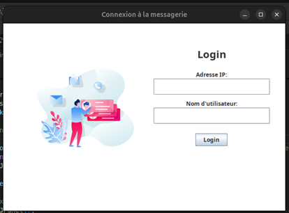

# Instant-Chat-Application
This project is an instant messaging application that runs on a local area network (LAN), using a decentralized server. A decentralized architecture will allow users to interact with each other directly, making the system more robust against disconnections and IP address fluctuations.



## System Architecture

### 1. Client-Server Architecture

The system operates on a **client-server architecture**, where:
- **Server**: Manages client connections, maintains the list of connected users, and broadcasts messages to all connected clients.
- **Clients**: Users interact through a client which connects to the server. Clients send messages, update statuses, and receive messages and user lists from the server.

### 2. Components

- **Server**: Principal node that handles all communication between clients.
- **Clients**: Individual users who connect to the server to send/receive messages and status updates.

### 3. Data Flow

1. **Client Connection**:
   - Clients send their usernames to the server upon connection.
   - The server maintains a global list of connected users and broadcasts this list to all clients whenever a change occurs.
   
2. **Message Broadcasting**:
   - When a client sends a message, the server broadcasts it to all connected clients with the sender’s username.
   
3. **Status Updates**:
   - Clients can update their status (e.g., online, away, busy), and the server will propagate this information to all other clients.

4. **Client Disconnection**:
   - When a client disconnects, the server updates the list of connected users and broadcasts the new list to all clients.

## Communication Protocols

### 1. Transport Protocol: **TCP**

- **TCP** is used for reliable communication between the server and clients.
- It ensures that messages are delivered in the correct order and without loss, which is crucial for chat systems.

### 2. Message Protocol (Text-Based)

The communication between the server and clients follows a simple text-based protocol:

#### **Message Types**:

1. **User Connection**:
   - **Client → Server**: Sends the username when connecting.
   - **Server → Clients**: Broadcasts the updated list of connected users.

2. **User Message**:
   - **Client → Server**: Sends the message.
   - **Server → Clients**: Broadcasts the message with the sender’s username.

3. **User Status Update**:
   - **Client → Server**: Sends a status update (e.g., online, away, busy).
   - **Server → Clients**: Broadcasts the updated status to all clients.

4. **User Disconnection**:
   - **Client → Server**: Notifies the server when a user disconnects.
   - **Server → Clients**: Updates the list of connected users and broadcasts it.

## Project Setup and Launch Guidelines

### Requirements:
- **Java**: Ensure Java is installed on all machines (server and clients).
- **Ant**: You will need Ant for building and running the project.
- All machines should be on the **same local network** for testing.

## Features
This instant messaging application offers the following features:

1. **Local Area Network (LAN):**
Users can communicate in a local IP network.
The server listens for connections on a predefined port (port 12345) to allow clients to connect and exchange messages.
2. **Total Decentralization:**
There is no central server to manage users and exchange sessions.
The management of users and message exchanges is completely distributed. Each machine can run as a server and manage connections autonomously, allowing users to connect and disconnect dynamically.
3. **Asynchronous Communication:**
Communication between users is done in the form of asynchronous text messages. Users can send messages at any time, and these messages will be transmitted without blocking other ongoing operations.
4. **Connection Management:**
Each user can register when connecting by providing a unique nickname.
The system must dynamically manage connections and disconnections, automatically updating the list of connected users on each client workstation.
5. **Message Broadcasting:**
All messages sent by a user are broadcast to all other connected users, thus ensuring effective group communication.
6. **User Status:**
The system generates user statuses (connected, absent, busy) and updates this information on all connected clients.


### 1. Build the Project:

To compile the project, navigate to the root directory where the `build.xml` file is located and run:

```bash
ant compile
```

This will compile all the Java files into the `build/` directory.

### 2. Launch the Server:

1. **Find the server’s IP address** (the machine running the server):
   - On **Linux**:
     ```bash
     ifconfig
     ```
   - On **Windows**:
     ```cmd
     ipconfig
     ```
   The IP address will be something like `192.168.x.x`.

2. **Run the server**:
   ```bash
   java -cp build com.example.ServerGUI
   ```

### 4. Launch the Clients:

On each client machine:

1. **Run the client**:
   ```bash
   java -cp build com.example.LoginWindow
   ```

2. When prompted for the server's IP address, **enter the IP address** of the machine running the server (e.g., `192.168.x.x`).

3. Enter a **username** when prompted.

### 5. Firewall and Network Configuration:

- Ensure that **port 12345** (or the port being used) is open for communication on the server machine. You may need to configure the firewall:
   - **Linux (using `ufw`)**:
     ```bash
     sudo ufw allow 12345/tcp
     ```
   - **Windows**:
     Open **Windows Defender Firewall** and add an inbound rule for TCP port `12345`.

- Ensure that all machines (server and clients) are connected to the **same local network** (e.g., the same Wi-Fi network or Ethernet network).

### 6. Testing the Chat System:

Once all clients are connected to the server:
1. Send messages between clients to verify message broadcasting.
2. Change the status of clients and observe the updates on all connected clients.
3. Disconnect clients and check that the user list updates accordingly.

### Future Enhancements

1. **Multiple Chat Rooms**: Add support for multiple chat rooms where users can join or leave specific rooms.
2. **Private Messaging**: Implement direct messaging between clients.
3. **Encryption**: Add SSL/TLS encryption for secure communication.
4. **File Sharing**: Extend the system to allow file sharing between users.
